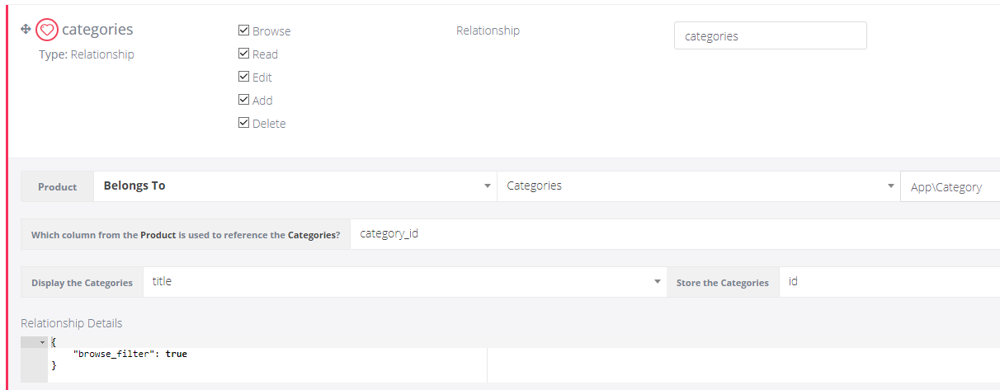

# Browse Filters (BREAD browse pages)

Browse filters add dropdowns above the table to quickly filter records.



## How to enable

1) Go to **Tools -> BREAD -> Edit BREAD**.
2) Open a field and add this to **Details**:

```json
{ "browse_filter": true }
```

Filters are most useful for **relationship fields** (category, status, parent).

## Relationship example

```json
{
  "browse_filter": true,
  "relationship": {
    "model": "App\\\\Models\\\\Category",
    "type": "belongsTo",
    "column": "category_id",
    "key": "id",
    "label": "name",
    "ref_field": "category_id",
    "filter_label": "Category"
  }
}
```

## How it works

- Filters are stored in the session so they persist when you paginate or return later.
- URL parameters are supported:

```
?field[0]=status&value[0]=1&field[1]=category_id&value[1]=10
```
