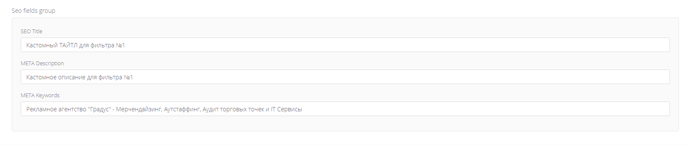

# Advanced Fields Group (`adv_fields_group`)

Simple grouped fields stored as JSON.



## What editors can do

- Fill a small group of related fields (e.g. SEO block).
- Keep them visually grouped inside the edit screen.

## How to add it in BREAD

1) Create a database column (TEXT recommended).
2) In **Tools -> BREAD -> Edit BREAD**, set the field type to `adv_fields_group`.
3) Add Details JSON.

## Details JSON (example)

```json
{
  "fields": {
    "seo_title": {
      "label": "SEO Title",
      "type": "text"
    },
    "meta_description": {
      "label": "Meta Description",
      "type": "textarea"
    },
    "meta_keywords": {
      "label": "Meta Keywords",
      "type": "textarea"
    }
  }
}
```

### Supported field types

`text`, `textarea`

## Stored data

Stored as JSON in the model field.

## Using in Blade / controllers

```php
$seo = json_decode($post->seo, true);
```

```blade
@if ($seo)
    <title>{{ $seo['fields']['seo_title']['value'] ?? '' }}</title>
    <meta name="description" content="{{ $seo['fields']['meta_description']['value'] ?? '' }}">
    <meta name="keywords" content="{{ $seo['fields']['meta_keywords']['value'] ?? '' }}">
@endif
```
