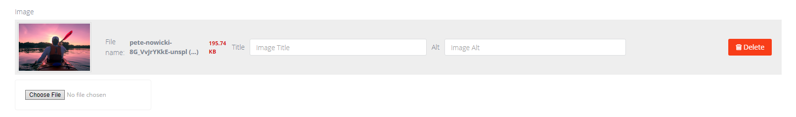

# Advanced Image (`adv_image`)

This field is for a **single image** with title/alt metadata and cropping.



## What editors can do

- Upload or replace the image.
- Edit **Title** and **Alt** values.
- Crop the image.

## How to add it in BREAD

1) Create a database column for the image id (recommended: nullable integer).
2) In **Tools -> BREAD -> Edit BREAD**, set the field type to `adv_image`.
3) Add optional JSON details (example below).

## Details JSON (optional)

```json
{
  "collection_name": "cover"
}
```

**collection_name**  
Optional media collection name. If omitted, the field name is used.

## Stored data

The model column stores the **media id**:

```
cover_image_id = 123
```

The actual file and metadata are stored in the `media` table.

## Using in Blade / controllers

### Option A: via media relation (recommended)

```php
// model must use TCG\Voyager\Traits\HasMedia
$media = $post->getFirstMedia('cover');
```

```blade
@if ($media)
    url() }}?v={{ $media->updated_at?->getTimestamp() ?? $media->id }}"
         alt="{{ $media->prop('alt') }}"
         title="{{ $media->prop('title') }}">
@endif
```

### Option B: via stored media id

```php
$media = $post->media()->find($post->cover_image_id);
```

```blade
@if ($media)
    url() }}?v={{ $media->updated_at?->getTimestamp() ?? $media->id }}"
         alt="{{ $media->prop('alt') }}"
         title="{{ $media->prop('title') }}">
@endif
```
