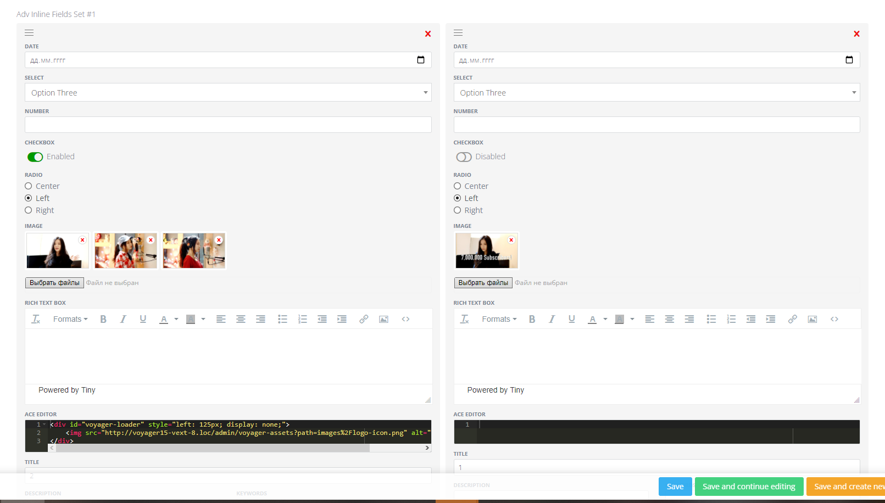

# Advanced Inline Set (`adv_inline_set`)

Flexible **repeatable blocks** stored as JSON in one field.



## What editors can do

- Add multiple rows (or a single row).
- Reorder rows by drag-and-drop.
- Use multiple field types inside each row.

## How to add it in BREAD

1) Create a database column (TEXT recommended).
2) In **Tools -> BREAD -> Edit BREAD**, set the field type to `adv_inline_set`.
3) Add the **inline_set** config in Details JSON.

## Details JSON (example)

```json
{
  "inline_set": {
    "many": true,
    "columns": 2,
    "fields": {
      "title": { "label": "Title", "type": "text", "class": "col-md-12" },
      "date": { "label": "Date", "type": "date", "class": "col-md-6" },
      "type": {
        "label": "Type",
        "type": "select",
        "options": { "news": "News", "promo": "Promo" },
        "class": "col-md-6"
      },
      "featured": { "label": "Featured", "type": "checkbox" },
      "content": { "label": "Content", "type": "richtext", "class": "col-md-12" },
      "code": { "label": "HTML", "type": "code", "class": "col-md-12" },
      "image": { "label": "Image", "type": "media", "class": "col-md-12" }
    }
  }
}
```

### Options

- **many**: `true` allows multiple rows; `false` keeps a single row.
- **columns**: layout columns for the block (1..6).
- **fields**: internal field definitions.

### Supported internal field types

`text`, `textarea`, `number`, `select`, `checkbox`, `radio`, `date`, `richtext`, `code`, `media`

## Stored data

All rows are stored as JSON in the same model field.  
This fork does **not** use separate storage tables for inline sets.

## Using in Blade / controllers

```php
$rows = json_decode($post->features, true) ?: [];
```

```blade
@foreach ($rows as $row)
    <h3>{{ $row['title'] ?? '' }}</h3>
    <div>{!! $row['content'] ?? '' !!}</div>
    @if (!empty($row['image']))
        
    @endif
@endforeach
```

Media fields inside inline sets are stored as an array (id + url + props).
Use the `url` value for output.
