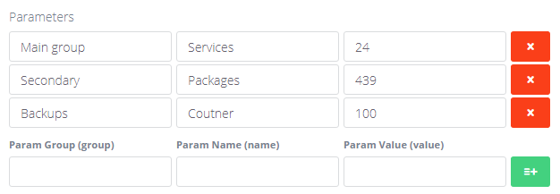

# Advanced JSON (`adv_json`)

Sortable list of key/value rows stored as JSON.



## What editors can do

- Add multiple rows of fields.
- Reorder rows.
- Remove rows.

## How to add it in BREAD

1) Create a database column (TEXT recommended).
2) In **Tools -> BREAD -> Edit BREAD**, set the field type to `adv_json`.
3) Add Details JSON.

## Details JSON (example)

```json
{
  "json_fields": {
    "group": "Group",
    "name": "Name",
    "value": "Value"
  }
}
```

This defines the columns shown in each row.

## Stored data

Stored as JSON in the model field, with rows array.

## Using in Blade / controllers

```php
$data = json_decode($post->specs, true) ?: [];
$rows = $data['rows'] ?? [];
```

```blade
@foreach ($rows as $row)
    <div>
        <strong>{{ $row['name'] ?? '' }}</strong>:
        {{ $row['value'] ?? '' }}
    </div>
@endforeach
```
