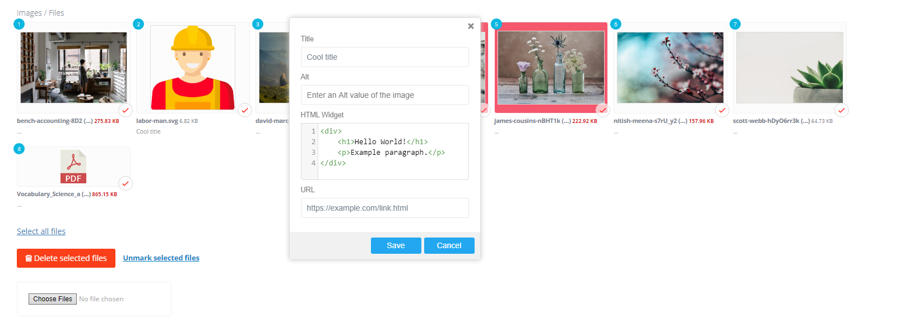

# Advanced Media Files (`adv_media_files`)

Gallery/collection field for **multiple files** (images or documents).



## What editors can do

- Upload many files.
- Drag-and-drop to reorder.
- Edit metadata per file (Title, Alt, plus custom fields).
- Replace a file without losing its metadata.
- Crop images (if the item is an image).

## How to add it in BREAD

1) Create a database column (nullable integer is fine).
2) In **Tools -> BREAD -> Edit BREAD**, set the field type to `adv_media_files`.
3) Add Details JSON (example below).

## Details JSON (example)

```json
{
  "collection_name": "gallery",
  "input_accept": "image/*,.pdf,.zip",
  "extra_fields": {
    "subtitle": { "type": "text", "title": "Subtitle" },
    "content":  { "type": "ace",  "title": "HTML", "class": "col-md-12" },
    "link":     { "type": "text", "title": "Link" }
  }
}
```

### Options

- **collection_name**: media collection name (defaults to the field name).
- **input_accept**: value for the file input `accept` attribute.
- **extra_fields**: extra metadata fields stored in `media.props`.
  - Supported types: `text`, `textarea`, `ace`.
  - `class` can be any grid class (e.g. `col-md-6`).

## Stored data

Each file is a row in the `media` table with:

- `collection_name` (from details or field name)
- `order` (after drag-and-drop)
- `props` (Title, Alt, plus extra fields)

The model column stores a compact link to the collection (internally managed).

## Using in Blade / controllers

```php
// model must use TCG\Voyager\Traits\HasMedia
$items = $post->getMedia('gallery');
```

```blade
@foreach ($items as $media)
    @if ($media->isImage())
        url() }}?v={{ $media->updated_at?->getTimestamp() ?? $media->id }}"
             alt="{{ $media->prop('alt') }}"
             title="{{ $media->prop('title') }}">
    @else
        <a href="{{ $media->url() }}">{{ $media->fileName() }}</a>
    @endif
@endforeach
```

Extra fields are in `props`:

```blade
{{ $media->prop('subtitle') }}
{{ $media->prop('link') }}
```
