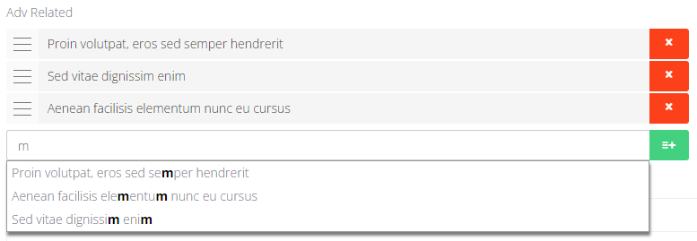

# Advanced Related (`adv_related`)

Sortable list of related records with autocomplete.



## What editors can do

- Search and add related items.
- Reorder the list by drag-and-drop.
- Remove items from the list.

## How to add it in BREAD

1) Create a database column (TEXT recommended).
2) In **Tools -> BREAD -> Edit BREAD**, set the field type to `adv_related`.
3) Add Details JSON.

## Details JSON (example)

```json
{
  "related_model": {
    "source": "pages",
    "search_field": "title",
    "display_field": "title",
    "fields": ["title", "slug", "price"]
  }
}
```

### Options

- **source**: BREAD slug of the related model.
- **search_field**: field used for search.
- **display_field**: field shown in the list.
- **fields**: list of fields to store in JSON for each item.

## Stored data

Stored as JSON array in the model field.  
Each item contains `id` plus the fields listed in the config.

## Using in Blade / controllers

```php
$items = json_decode($post->related_pages, true) ?: [];
```

```blade
@foreach ($items as $item)
    <a href="/pages/{{ $item['fields']['slug'] ?? '' }}">
        {{ $item['fields']['title'] ?? '' }}
    </a>
@endforeach
```
